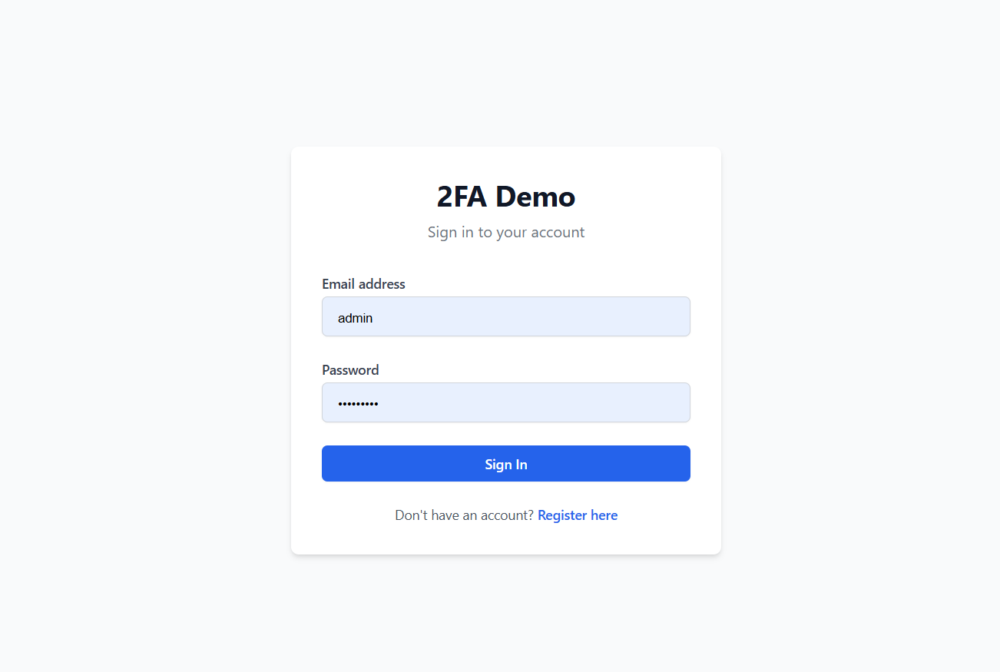
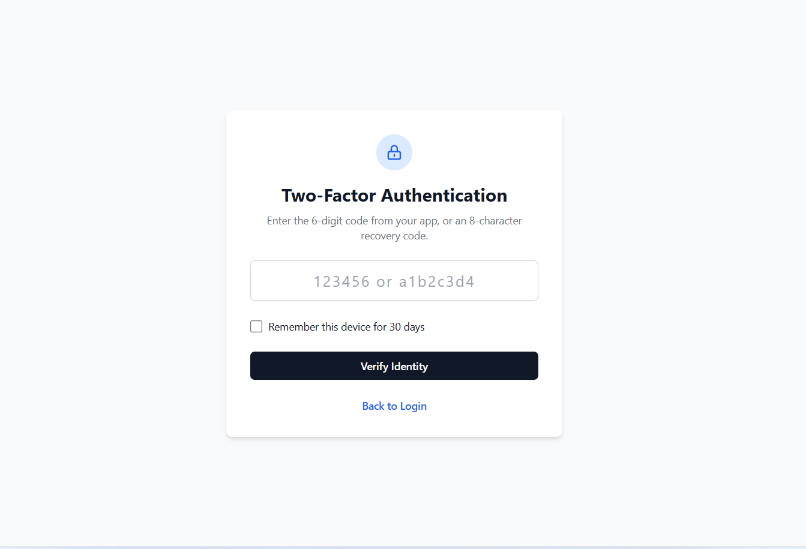
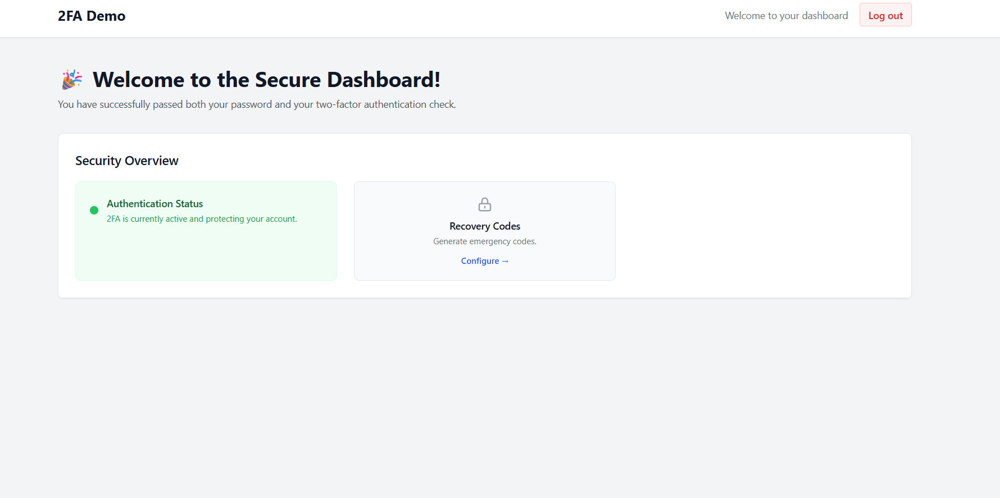

# 🔐 2FA Demo (PHP Authentication System)

A secure and lightweight authentication system built with PHP that implements **Two-Factor Authentication (2FA)** using OTP verification.

---

## 🚀 Features

* User Registration & Login
* OTP Verification (2FA Security Layer)
* Secure Password Hashing (`password_hash`)
* Session-Based Authentication
* QR Code Support (optional - Google Authenticator)
* Clean and scalable architecture (beginner-friendly)

---

## 🔐 How 2FA Works

1. User logs in with email & password
2. System verifies credentials
3. OTP is generated and stored
4. User enters OTP
5. Access granted to dashboard

---

## 🛠️ Tech Stack

* **Backend:** PHP (Core)
* **Database:** MySQL
* **Frontend:** HTML, CSS
* **Libraries:** OTP / QR Code (if enabled)

---

## ⚙️ Installation & Setup

### 1️⃣ Clone Repository

git clone https://github.com/mukeshind4u/2fa-demo.git

### 2️⃣ Move to Project Folder

cd 2fa-demo

### 3️⃣ Setup Database

* Open phpMyAdmin
* Create database: `2fa_demo`
* Import file: `auth_test.sql`

### 4️⃣ Configure Database

Update credentials in:
config/database.php

### 5️⃣ Run Project

http://localhost/2fa-demo/auth/login.php

---

## 📂 Project Structure

2fa-demo/
│── auth/
│   ├── login.php
│   ├── register.php
│   ├── logout.php
│   ├── challenge.php
│   ├── setup-2fa.php
│
│── config/
│   └── database.php
│
│── assets/
│── screenshots/
│── vendor/
│── auth_test.sql
│── dashboard.php
│── composer.json
│── README.md

---

## 📸 Screenshots

### 🔑 Login Page

### 🔐 OTP Verification

### 📊 Dashboard

---

## 🔒 Security Features

* Password hashing using `bcrypt`
* OTP expiration handling
* Session protection
* SQL injection prevention (prepared statements)

---

## 🤝 Contribution

Contributions are welcome!
Feel free to fork the repository and improve the project.

---

## 👨‍💻 Author

**Mukesh Kumar**
GitHub: https://github.com/mukeshind4u

---

## 📄 License

This project is open-source and free for learning purposes.
